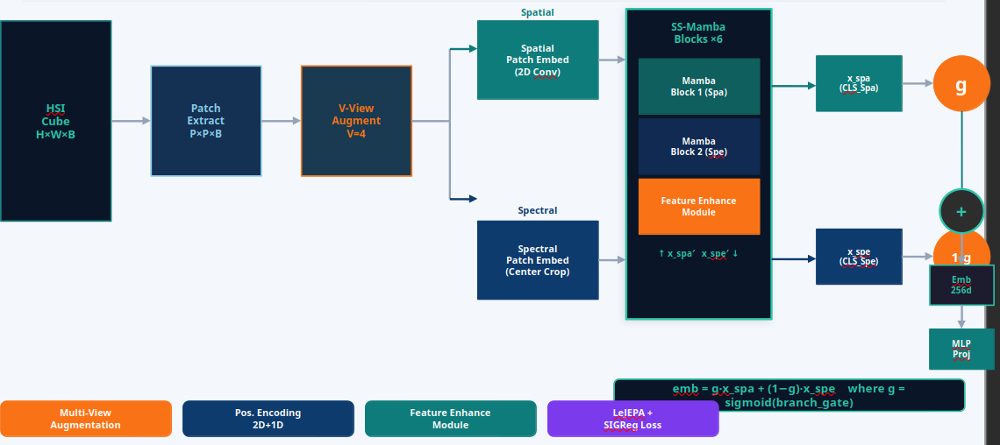

# GateMamba 🌿

### Self-Supervised Hyperspectral Image Classification via Gated Spectral-Spatial Mamba Encoder and Joint Embedding Predictive Architecture

> **B.Tech Thesis** · IIT Bombay · Department of Electrical Engineering
> **Author:** Parthiv Sen · **Guide:** Prof. Biplab Banerjee

---

## Overview

Hyperspectral images (HSI) carry hundreds of spectral bands per pixel, encoding rich material-level signatures invisible to ordinary cameras. Classifying every pixel into land-cover categories is critical for precision agriculture, environmental monitoring, and urban mapping — but pixel-level annotation is expensive and scarce.

**GateMamba** is a self-supervised pre-training framework that learns powerful spectral-spatial representations from *unlabelled* HSI data. It combines three core ideas:

| Component | What it does |
|---|---|
| **Dual-branch Mamba encoder** | Models spatial patch tokens and spectral band tokens jointly via bidirectional selective state-space scans — linear complexity, no quadratic attention |
| **Trainable per-dimension branch gate** | A sigmoid-gated convex combination of spatial and spectral CLS tokens; each of the 256 embedding dimensions independently learns how much to trust spatial vs. spectral context |
| **LeJEPA + SIGReg objective** | Self-supervised invariance loss across augmented views with a Sliced Information-Geometry Regulariser to prevent representational collapse — no negative pairs needed |

A **residual MLP probe** trained on frozen encoder features via stop-gradient handles final pixel classification.

---

## Architecture

<!-- Add pipeline diagram image here -->


---

## Setup

### 1. Clone and create environment

```bash
git clone https://github.com/22b1055/GateMamba.git
cd GateMamba
conda create -n gatemamba python=3.10 -y
conda activate gatemamba
pip install torch torchvision --index-url https://download.pytorch.org/whl/cu118
pip install mamba-ssm causal-conv1d scipy numpy wandb hydra-core omegaconf tqdm
```

### 2. Download datasets

```bash
bash install.sh
```

Downloads Indian Pines, Pavia University, and Salinas into `data/`.

### 3. Train

```bash
bash run.sh
```

Checkpoints and results are saved to `logs/`. Metrics are tracked via Weights & Biases (offline by default).

---

## Configuration

Key hyperparameters (overridable via Hydra CLI):

| Parameter | Default | Description |
|---|---|---|
| `epochs` | 700 | Total training epochs |
| `bs` | 64 | Batch size |
| `V` | 2 | Number of augmented views |
| `proj_dim` | 128 | Projector output dimension |
| `lr` | 3e-4 | Encoder learning rate |
| `lamb` | 0.5 | SIGReg vs invariance loss weight |
| `depth` | 4 | Number of Mamba blocks |
| `hid_chans` | 32 | Channels after spectral dim. reduction |
| `spa_patch_size` | 1 | Spatial patch token size |
| `spe_patch_size` | 5 | Spectral patch token size |
| `center_size` | 3 | Centre crop size for spectral branch |

---

## Results

60% train / 40% test random split (seed 0). GateMamba uses **no pixel labels** during encoder pre-training.

| Method | Paradigm | IP OA | IP AA | IP κ | PU OA | PU AA | PU κ | SA OA | SA AA | SA κ |
|---|---|---|---|---|---|---|---|---|---|---|
| SVM | Supervised | 85.30 | 79.03 | 0.8310 | 94.34 | 92.98 | 0.9250 | 92.95 | 94.60 | 0.9211 |
| 3-D CNN | Supervised | 91.10 | 91.58 | 0.8998 | 96.53 | 97.57 | 0.9551 | 93.96 | 97.01 | 0.9332 |
| SpectralFormer | Supervised | 83.07 | 80.11 | 0.8086 | 86.28 | 83.12 | 0.8231 | 91.70 | 90.44 | 0.9078 |
| HybridSN | Supervised | **99.75** | **99.63** | **0.9971** | **99.98** | **99.97** | **0.9998** | **100.00** | **100.00** | **1.0000** |
| SS-Mamba | Supervised | 93.95 | 91.79 | 0.9325 | 93.42 | 91.18 | 0.9142 | 95.74 | 94.89 | 0.9526 |
| MAE-HSI | Self-sup. | 89.42 | 87.18 | 0.8762 | 92.17 | 90.45 | 0.9013 | 93.58 | 92.31 | 0.9286 |
| LeJEPA-ViT | Self-sup. | 91.57 | 88.93 | 0.9027 | 93.84 | 91.76 | 0.9211 | 94.73 | 93.47 | 0.9415 |
| **GateMamba (ours)** | **Self-sup.** | <u>99.10</u> | <u>98.02</u> | <u>0.9897</u> | <u>99.70</u> | <u>99.61</u> | <u>0.9960</u> | <u>96.50</u> | <u>97.18</u> | <u>0.9611</u> |

> IP = Indian Pines · PU = Pavia University · SA = Salinas
> **Bold** = best overall · <u>Underline</u> = best self-supervised / second overall

GateMamba is the **best self-supervised method by a large margin** across all three datasets, and is competitive with fully supervised methods despite using no labels during pre-training.
